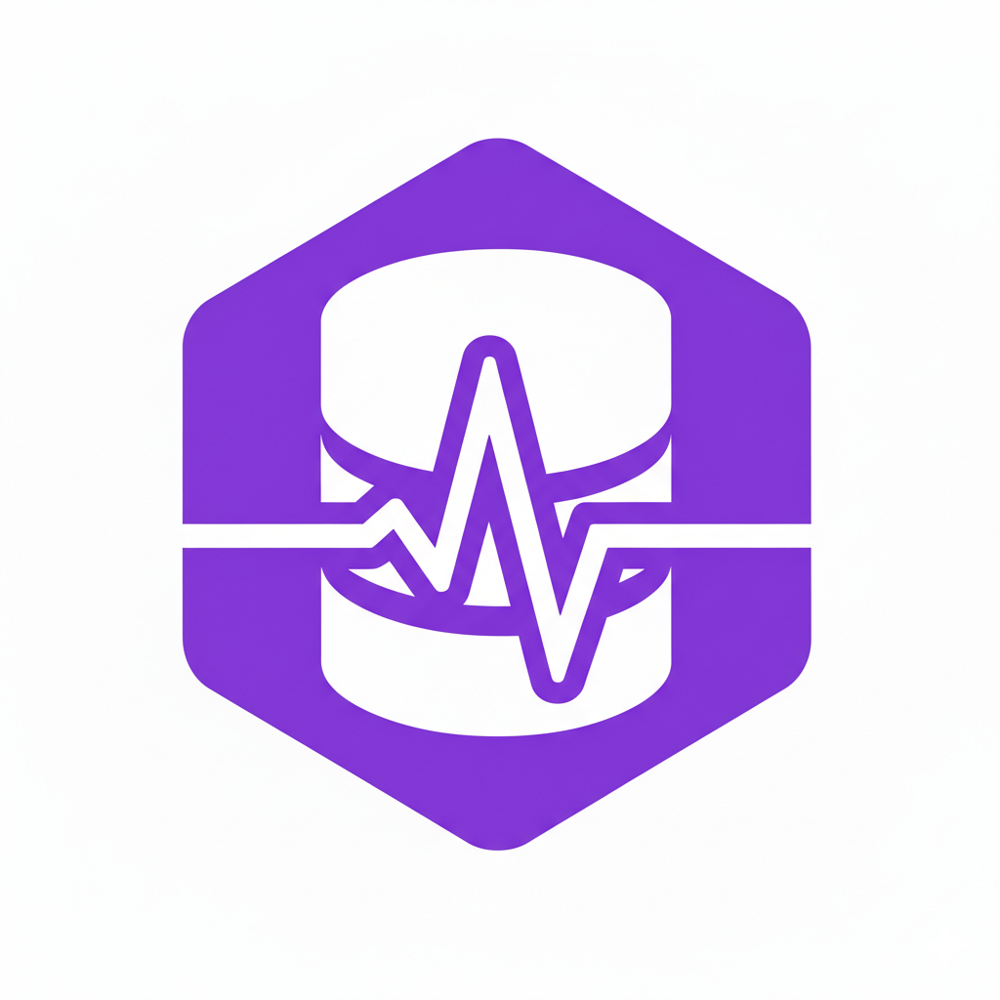

<div align="center">



# 🏥 DB-Doctor

### **MySQL Database "Autopilot" Diagnosis Platform Powered by DeepSeek/LLM**

**Say goodbye to slow queries, let DB-Doctor give your database an intelligent doctor!**

[](https://openjdk.org/projects/jdk/17/)
[](https://spring.io/projects/spring-boot)
[](https://docs.langchain4j.dev)
[](https://vuejs.org/)
[](LICENSE)

[](https://star-history.com/#hanpf2391/DB-Doctor&Date)

**[Quick Start](#-quick-start)** •
**[Features](#-core-features)** •
**[Architecture](#-system-architecture)** •
**[Online Demo](#-online-demo)** •
**[Contributing](#-contributing-guide)**

</div>

---

## 📖 Project Overview

**DB-Doctor** is a non-intrusive MySQL slow query intelligent diagnosis system based on **multi-AI Agent collaboration**. It monitors MySQL slow query logs in real-time and uses large language models (DeepSeek/Ollama/Qwen/etc.) to analyze root causes and push optimization recommendations.

### 🎯 Why Choose DB-Doctor?

| Feature | DB-Doctor | Traditional Solutions |
|---------|-----------|----------------------|
| **Data Security** | ✅ Supports Ollama local deployment, data never leaves your domain | ❌ Requires uploading to cloud |
| **Business Intrusion** | ✅ Read-only access, zero business intrusion | ⚠️ Requires modifying business code or importing SDK |
| **Diagnosis Efficiency** | ✅ AI automatic analysis, second-level response | ❌ Manual troubleshooting, time-consuming |
| **Accuracy** | ✅ Multi-Agent collaboration, deep reasoning | ⚠️ Experience-based rules, high false positive rate |
| **Deployment Cost** | ✅ Docker one-click deployment, 5 minutes to get started | ❌ Complex configuration, high learning curve |

---

## ✨ Core Features

### 🤖 **Multi-AI Agent Collaboration Mechanism**
- **Attending Physician Agent**: Preliminary diagnosis, collect evidence (table structure, execution plan, index information)
- **Reasoning Expert Agent**: Deep reasoning, find root causes (escalate analysis for complex issues)
- **Coding Expert Agent**: Generate optimization code (index creation, SQL rewriting)

### 🔒 **Data Never Leaves Your Domain**
- ✅ Supports **Ollama + DeepSeek R1** local deployment
- ✅ Supports Qwen, OpenAI, and other cloud models
- ✅ Automatic sensitive data masking (SQL parameters, passwords, etc.)

### 🚀 **Non-Intrusive Design**
- ✅ Read-only access to MySQL, zero business intrusion
- ✅ No need to modify business code or import JAR packages
- ✅ Standalone deployment, zero impact on existing systems

### 🧠 **Intelligent Deduplication & Aggregation**
- ✅ Uses Druid SQL fingerprint calculation to automatically identify duplicate SQL
- ✅ Template + Sample dual-table architecture to avoid notification spam
- ✅ Incremental statistics to track performance trends

### 📊 **AI Monitoring & Cost Analysis**
- ✅ Complete Token statistics (input/output/total cost)
- ✅ Multi-model cost analysis (DeepSeek, GPT-4, Qwen, etc.)
- ✅ Single analysis tracking (traceId correlates complete analysis chain)
- ✅ Error classification and circuit breaker protection

### 📢 **Multi-Channel Notifications**
- ✅ Email notifications (SMTP)
- ✅ DingTalk bot (Webhook + signature verification)
- ✅ Feishu bot (Webhook)
- ✅ Enterprise WeChat (Webhook)

---

## 🎬 Demo Video

<!-- GIF demo placeholder -->
<!--
<p align="center">
  
</p>

**Demo Content**:
1. Discover slow query (or simulate one)
2. DB-Doctor AI Agent thinking and analysis process
3. Provide index suggestions/optimization solutions
4. (Optional) Performance comparison
-->

<!-- Bilibili video placeholder -->
### 📺 Complete Demo Video
[](https://www.bilibili.com/video/XXXXX)

**Click to Watch**: [DB-Doctor Complete Demo](https://www.bilibili.com/video/XXXXX) (Coming soon...)

---

## 🏗️ System Architecture

```
┌─────────────────────────────────────────────────────────────────────┐
│                         DB-Doctor System Architecture                 │
├─────────────────────────────────────────────────────────────────────┤
│  ┌────────────────┐    ┌────────────────┐    ┌────────────────┐   │
│  │   Vue 3 UI     │    │  Spring Boot   │    │   AI Agents    │   │
│  │                │◄──►│     Backend     │◄──►│  (LangChain4j) │   │
│  │  - Dashboard   │    │                │    │                │   │
│  │  - Report List │    │  - REST API    │    │  - Attending   │   │
│  │  - AI Monitor  │    │  - Scheduled    │    │    Physician   │   │
│  │  - Config Ctr  │    │  - Async Proc   │    │  - Reasoning   │   │
│  └────────────────┘    └────────────────┘    │  - Coding       │   │
│                                │             └────────────────┘   │
└────────────────────────────────┼───────────────────────────────────┘
                                 │
                    ┌────────────┴────────────┐
                    │                         │
            ┌───────▼────────┐       ┌────────▼────────┐
            │  H2 Database   │       │  MySQL Target   │
            │  (Internal)     │       │  (Read-Only)    │
            │                │       │                │
            │  - Template    │       │  - slow_log    │
            │  - Sample      │       │  - information │
            │  - AI Logs     │       │    _schema     │
            │  - System Cfg  │       │                │
            └────────────────┘       └────────────────┘
```

### Core Business Flow

```
┌─────────────────────────────────────────────────────────────────────────┐
│                    Slow Query Processing Complete Flow                   │
├─────────────────────────────────────────────────────────────────────────┤
│                                                                         │
│  1. Data Collection → 2. Processing → 3. AI Analysis → 4. Notify → 5.  │
│                                                                         │
│  Poll mysql.slow_log → SQL Fingerprint → Multi-Agent → Smart Strategy  │
│  (Every 5 sec)      → Deduplication → Collaboration → Batch Send       │
│                                                                         │
└─────────────────────────────────────────────────────────────────────────┘
```

---

## 🚀 Quick Start

### Method 1: Docker Deployment (Recommended)

<!-- Docker image placeholder -->
```bash
# 1. Pull image (image building in progress...)
docker pull ghcr.io/hanpf2391/db-doctor:latest

# 2. Run container
docker run -d \
  --name db-doctor \
  -p 8080:8080 \
  -e LANGCHAIN4J_OPEN_AI_API_KEY=your-api-key \
  -e SPRING_DATASOURCE_PASSWORD=your-mysql-password \
  ghcr.io/hanpf2391/db-doctor:latest

# 3. Access Web UI
open http://localhost:8080
```

### Method 2: Local Development

#### Prerequisites

- **JDK 17+**
- **Maven 3.6+**
- **MySQL 5.7+ / 8.0+**
- **Node.js 16+** (for frontend development)
- **LLM API Key** (DeepSeek/Ollama/Qwen/OpenAI)

#### 1. Clone the Project

```bash
git clone https://github.com/hanpf2391/DB-Doctor.git
cd DB-Doctor
```

#### 2. Configure Database

Edit `src/main/resources/application-local.yml`:

```yaml
spring:
  datasource:
    url: jdbc:mysql://localhost:3306/information_schema
    username: root
    password: your_password
    driver-class-name: com.mysql.cj.jdbc.Driver

db-doctor:
  target-db:
    host: localhost
    port: 3306
    username: root
    password: your_password
```

#### 3. Configure AI Model

**Option A: Use DeepSeek (Recommended, Cost-Effective)**

```yaml
langchain4j:
  open-ai:
    chat-model:
      api-key: sk-your-deepseek-api-key
      base-url: https://api.deepseek.com/v1
      model-name: deepseek-chat
      temperature: 0.0
```

**Option B: Use Ollama Local Model (Data Never Leaves Domain)**

```yaml
langchain4j:
  open-ai:
    chat-model:
      base-url: http://localhost:11434/v1
      model-name: deepseek-r1:7b
      temperature: 0.0
```

First install Ollama and download DeepSeek R1 model:

```bash
# Install Ollama (Mac/Linux)
curl -fsSL https://ollama.com/install.sh | sh

# Windows - Download installer
# https://ollama.com/download

# Download DeepSeek R1 model (7B version ~4GB)
ollama pull deepseek-r1:7b

# Verify installation
ollama run deepseek-r1:7b
```

**Option C: Use Alibaba Cloud Qwen**

```yaml
langchain4j:
  open-ai:
    chat-model:
      api-key: sk-your-qwen-api-key
      base-url: https://dashscope.aliyuncs.com/compatible-mode/v1
      model-name: qwen-plus
```

#### 4. Configure Slow Query Log

**Method 1: Automatic Check (Recommended)**

DB-Doctor will automatically check MySQL configuration on startup and provide fix suggestions.

**Method 2: Manual Configuration**

```sql
-- Enable slow query log
SET GLOBAL slow_query_log = 'ON';
SET GLOBAL log_output = 'TABLE';
SET GLOBAL long_query_time = 2.0;

-- Verify configuration
SHOW VARIABLES LIKE 'slow_query%';
SHOW VARIABLES LIKE 'long_query_time';
```

#### 5. Start Backend

```bash
# Method 1: Maven run
mvn spring-boot:run

# Method 2: Package and run
mvn clean package -DskipTests
java -jar target/db-doctor-3.0.0.jar
```

#### 6. Start Frontend (Development Mode)

```bash
cd frontend

# Install dependencies
npm install
# or use pnpm
pnpm install

# Start dev server
npm run dev
```

Access: http://localhost:5173

#### 7. Access Web UI

After successful startup, visit: http://localhost:8080

<!-- Screenshot placeholder -->
<!--
<p align="center">
  
  
  
</p>
-->

---

## 📚 Feature Details

### 1. Multi-AI Agent Collaboration Mechanism

DB-Doctor uses **ReAct (Reasoning + Acting)** pattern with multiple agents working together:

| Agent | Role | Responsibility | Trigger Condition |
|-------|------|----------------|-------------------|
| **Attending Physician** | Primary Diagnosis | Collect evidence (table structure, execution plan, index info) | All slow queries |
| **Reasoning Expert** | Advanced Diagnosis | Deep reasoning, find root causes | Complex issues (high freq/severe/lock wait/full table scan) |
| **Coding Expert** | Optimization Implementation | Generate optimization code (index creation, SQL rewriting) | Issues needing upgrade |

**Escalation Trigger Conditions**:
- High-frequency SQL: >100 occurrences in 24 hours
- Severe slow query: Average time >3 seconds
- Lock wait issue: Average lock wait >0.1 seconds
- Suspected full table scan: Scan/Return ratio >1000

### 2. SQL Fingerprint Deduplication

Uses **Druid SQL Parser** to calculate SQL fingerprint (MD5), automatically identifying parameterized SQL patterns:

```java
// Example: These SQLs will be identified as the same fingerprint
SELECT * FROM users WHERE id = 1;
SELECT * FROM users WHERE id = 2;
SELECT * FROM users WHERE id = 100;

// SQL Fingerprint: md5("SELECT * FROM users WHERE id = ?")
// SQL Template: SELECT * FROM users WHERE id = ?
```

### 3. Template + Sample Dual-Table Architecture

- **Template Table**: Stores SQL templates and aggregated statistics (avg time, max time, occurrence count, etc.)
- **Sample Table**: Stores specific SQL for each capture (preserves complete history)

**Advantages**:
- ✅ Avoid duplicate analysis
- ✅ Reduce storage space
- ✅ Track performance trends

### 4. Dynamic Data Source Hot Reload

After modifying database configuration, no need to restart the application. Click "Reload Config" to take effect:

```java
// Config hot reload process
1. User modifies config in Web UI
2. Save to H2 database system_config table
3. DynamicDataSourceManager detects config change
4. Close old data source, initialize new one
5. Atomic reference update (thread-safe)
```

### 5. AI Monitoring & Cost Analysis

- **Token Statistics**: Input/Output/Total token counts
- **Cost Analysis**: Classify and analyze costs by model and agent
- **Error Classification**: BLOCKING, TRANSIENT, PERMANENT
- **Circuit Breaker Protection**: Auto-circuit after N consecutive failures to avoid wasting tokens

---

## 📊 Usage Example

### Slow Query Notification Example

```
🔴 [Slow Query Alert] Database Performance Anomaly

SQL Statement:
SELECT * FROM users WHERE username LIKE '%1234%'

📊 Performance Metrics:
  - Query Time: 3.5 seconds
  - Lock Wait Time: 0.01 seconds
  - Rows Examined: 10,000
  - Rows Sent: 5

🤖 AI Analysis:
  1. Root Cause: Leading wildcard query (LIKE '%...%') causes full table scan
  2. Optimization Suggestions:
     - Avoid leading wildcards, use LIKE '1234%' instead
     - Consider adding full-text index
     - Use Elasticsearch or other search engines

📈 Statistics:
  - Occurrences: 1st time
  - Avg Query Time: 3.5 seconds
  - Max Query Time: 3.5 seconds
```

---

## 🛠️ Tech Stack

| Component | Technology | Version |
|-----------|-----------|---------|
| **Backend Framework** | Spring Boot | 3.2.2 |
| **Java Version** | OpenJDK | 17 |
| **AI Framework** | LangChain4j | 0.36.1 |
| **Database** | H2 (Internal) + MySQL (Target) | - |
| **Frontend Framework** | Vue 3 + Element Plus | 3.x |
| **SQL Parser** | Druid | 1.2.20 |
| **Utility Libraries** | Hutool, FastJSON2 | 5.8.27, 2.0.47 |

---

## 📄 Configuration

### Environment Check Configuration

```yaml
db-doctor:
  env-check:
    enabled: true            # Enable environment check
    fail-on-error: false     # Block startup on check failure
    auto-fix: false          # Attempt auto-fix (requires SUPER privilege)
```

### Slow Query Monitor Configuration

```yaml
db-doctor:
  slow-log-monitor:
    poll-interval-ms: 5000           # Poll interval (milliseconds)
    max-records-per-poll: 100        # Max records per poll
    auto-cleanup:
      enabled: true                  # Enable auto cleanup
      cron-expression: "0 0 3 * * ?" # Cleanup task cron expression
```

### Notification Configuration

```yaml
db-doctor:
  notify:
    enabled-notifiers: email,webhook
    notify-interval: 3600            # Notification interval (seconds)
    severity-threshold: 3.0          # Severity threshold

    email:
      enabled: true
      from: DB-Doctor <noreply@example.com>
      to:
        - dba@example.com
```

---

## 🧪 Test Database

The project provides complete performance test database scripts:

### 1. Initialize Test Database

```bash
mysql -u root -p < src/main/resources/test-db-setup.sql
```

**Includes**:
- ✅ 7 tables (users, products, orders, order_items, categories, user_behavior_logs, payments)
- ✅ 370,000+ test records
- ✅ Covers various field types
- ✅ Auto-configures slow query threshold (0.5 seconds)

### 2. Execute Slow Query Tests

```bash
mysql -u root -p test_db < src/main/resources/靶数据库.sql
```

**Includes 20 test scenarios**:
- Full table scan
- Fuzzy query (LIKE %...%)
- Deep pagination
- Complex JOIN
- Subquery
- Aggregation query
- Sorting query
- Non-indexed field query
- And more...

---

## 📈 Roadmap

- [x] v1.0.0 - Basic slow query monitoring
- [x] v2.0.0 - Dynamic environment awareness + SQL fingerprint deduplication
- [x] v3.0.0 - Dynamic data source + config hot reload
- [ ] v3.1.0 - Notification enhancement (email/Webhook delivery)
- [ ] v3.2.0 - Report export (PDF/Word)
- [ ] v3.3.0 - Custom notification rules
- [ ] v4.0.0 - Multi-tenant support (monitor multiple MySQL instances)
- [ ] v4.1.0 - PostgreSQL support
- [ ] v4.2.0 - Distributed deployment (message queue decoupling)

---

## 🤝 Contributing Guide

Issues and Pull Requests are welcome!

### Contribution Process

1. Fork this project
2. Create a feature branch (`git checkout -b feature/AmazingFeature`)
3. Commit your changes (`git commit -m 'feat: Add some feature'`)
4. Push to the branch (`git push origin feature/AmazingFeature`)
5. Submit a Pull Request

### Code Standards

- ✅ Follow Alibaba Java Coding Guidelines
- ✅ No hardcoding, all parameters from config files
- ✅ Use Slf4j logging framework, no System.out.println
- ✅ Exceptions must be logged and re-thrown
- ✅ All public classes and methods must have JavaDoc

---

## 🙏 Acknowledgments

Thanks to the following open source projects and tech communities:

- [DeepSeek](https://www.deepseek.com/) - Open source large language model
- [Ollama](https://ollama.com/) - Local model runtime tool
- [LangChain4j](https://docs.langchain4j.dev/) - Java AI framework
- [Spring Boot](https://spring.io/projects/spring-boot) - Java development framework
- [Vue 3](https://vuejs.org/) - Progressive frontend framework
- [Element Plus](https://element-plus.org/) - Vue 3 component library
- [Druid](https://github.com/alibaba/druid) - SQL parser

---

## 📮 Contact

<!-- WeChat QR code placeholder -->
<!--
<div align="center">
  
  <p>Scan to join DB-Doctor Technical Discussion Group</p>
</div>
-->

- **Author**: hanpf
- **Email**: 2391303768@qq.com
- **GitHub**: https://github.com/hanpf2391/DB-Doctor
- **Gitee**: https://gitee.com/hanpf2391/DB-Doctor

---

## 📄 License

This project is open sourced under [MIT License](LICENSE).

---

## ⭐ Star History

[](https://star-history.com/#hanpf2391/DB-Doctor&Date)

If this project helps you, please give us a Star ⭐

---

## 🌍 Internationalization

- 🇨🇳 [中文文档](README.md)
- 🇺🇸 [English Documentation](README_EN.md)

---

<div align="center">

**Made with ❤️ by hanpf**

**Give every database an intelligent doctor**

</div>
